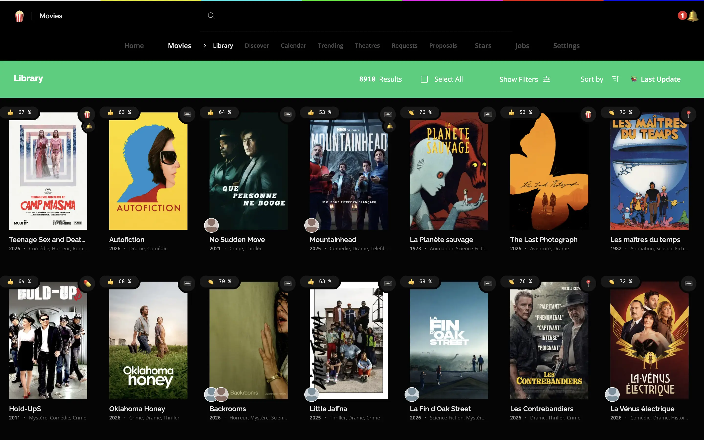

# Sensorr

> 🍿📼 Your Friendly Digital Video Recorder. Think VCR but in modern times.

Sensorr watches for the movies and the TV series you want. You keep a library of wished
movies, a library of followed shows and a list of people you follow, and on a schedule
Sensorr searches your Torznab indexers, scores every release it finds against your policies,
and drops the winning `.torrent` file into a blackhole directory for your download client to
pick up. Out of the shipped configuration it
queues that release as a proposal instead, and waits for you to accept it. It reads TMDB for
metadata, your Plex server for what you already own, and your friends' Plex watchlists for
what they would like to see. For series it also takes the finished files out of your
download client's folder and hard links them into the shows library. It is meant for one
person hosting their own library at home.



<sub>Library screen, captured 2026-09-18. More screens in [`docs/assets/screenshots/`](docs/assets/screenshots/).</sub>

# Features

- **A library with states.** A movie is `Pinned`, `Wished`, `Archived`, `Ignored` or `Missing`. `record` hunts the wished ones, `refine` and `shrink` go back over the archived ones.
- **Follow people.** Follow a director, an actor, a composer, and the Calendar lists what they release, month by month.
- **Torznab indexers.** Declare as many as you want, enable and disable them one by one.
- **Policies instead of a quality profile.** Seven axes, source, encoding, resolution, language, dub, flags and indexer, each split in three groups: `avoid` rejects a release outright, `prefer` ranks the rest by score, `require` is the end-goal `refine` works towards.
- **Blackhole downloads.** Sensorr writes the release file into your blackhole directory, always named `.torrent`, and your download client does the rest.
- **Seven scheduled jobs for movies.** Each job takes the media type as its argument, `record movies` or `record shows`, and the ones below run on `movies`. `record` grabs the best release available for wished movies, `refine` looks for a better fitting one for archived movies, `shrink` for the smallest one for refined movies, `refresh` re-fetches TMDB metadata for every movie and person you store, `sync` reconciles the library with Plex, `keep-in-touch` reads your friends' watchlists, `report` replaces a movie a friend reported from Plex.
- **Proposals.** `record`, `refine`, `shrink` and `report` can be set to `proposalOnly`: they submit what they found instead of downloading it, and you pick from the comparison screen.
- **Requests from friends.** A friend links their Plex account with a code, and `keep-in-touch` turns the movies on their Plex watchlist into requests. A movie Sensorr did not know lands as `Ignored`, never `Wished`; you decide from the Requests screen.
- **Browse TMDB from inside Sensorr.** Discover, Trending, Calendar, Theatres, Collections, Recommendations and Similar.
- **A library of series, with seasons and episodes.** A show page lists every season and every episode TMDB knows, with how many aired episodes you own. Each episode is `upcoming`, `unmonitored`, `wanted`, `proposed` or `owned`. The Shows section adds a Calendar of the episodes of followed shows, Discover and Trending.
- **Follow at three levels.** A whole show, one season or one episode. A followed show can also follow the seasons TMDB adds later. Specials, season 0, are only followed by hand.
- **Whole series, season packs or episodes, chosen by coverage.** An ended show you follow whole and own nothing of is searched as a complete series first, then season by season, then episode by episode. A season pack is only searched once every episode of it has aired and is followed. The policies rank the releases inside each level, the same policies as movies.
- **Proposals for series.** `record shows` and `airing shows` queue what they found as proposals out of the shipped configuration, and a show can say otherwise. A pending release is named by what it covers, `S01-S10`, `S03` or `S03E04`, on the show page and in its notification.
- **Hourly airing.** `airing shows` runs every hour and searches the followed episodes aired in the last seven days, one by one.
- **File import by hard link.** Show releases go to their own blackhole. Once the download client has written every file of one into the staging folder, `import shows` hard links the wanted episodes into `<Show (year)>/Season NN/` of the shows library, and Plex picks them up from there. A hard link takes no space, so the download client can keep seeding.
- **Migration from Sonarr.** `migrate sonarr`, a command run once by hand, takes over Sonarr's series, what Sonarr follows per season and per episode, whether it follows new seasons, and the folder of each show. It only reads Sonarr.
- **Requests from Plex watchlists, series included.** `keep-in-touch` reads the shows of a friend's watchlist too. A show Sensorr did not know lands in the library unfollowed, and nothing is searched until you follow it.
- **A PWA with web push.** Installable, and it pushes a notification when a job grabs a release, finds a movie missing from Plex, or picks up a request.
- **English and French.**

# Install

```sh
# Choose an install folder for Sensorr install and config files
mkdir ~/.sensorr && cd ~/.sensorr

# Download install files
curl -o docker-compose.yml https://raw.githubusercontent.com/thcolin/sensorr/dev/docker-compose.yml
curl -o config.json https://raw.githubusercontent.com/thcolin/sensorr/dev/config.default.json

# Set your own Sensorr secrets, username and password
echo "SENSORR_AUTH_SECRET=youshouldchangethisvaluetoanythingelse" >> .env
echo "SENSORR_USERNAME=username" >> .env
echo "SENSORR_PASSWORD=password" >> .env
echo "SENSORR_DATABASE_PASSWORD=anotherpassword" >> .env

# Define your "blackhole" directory where .torrent files will be downloaded
echo "SENSORR_BLACKHOLE=/home/user/downloads" >> .env

# Define your shows directory, mounted whole as /tvshows: the shows library, its blackhole and the download client's staging folder live under it, see "Series" below
echo "SENSORR_TVSHOWS=/home/user/tvshows" >> .env

# Define your "server contact information" (either a `mailto:` or `https` link) required if you want to enable web push notifications, see ["What is VAPID and why is it useful?"](https://stackoverflow.com/questions/40392257/what-is-vapid-and-why-is-it-useful)
echo "SENSORR_VAPID_SUBJECT=mailto:admin@example.com" >> .env

# Set your own TimeZone, see ["TZ identifier"](https://en.wikipedia.org/wiki/List_of_tz_database_time_zones#List)
echo "TZ=Europe/Paris" >> .env

# Launch the stack
docker compose up -d

# Sensorr is now available at,
# * http://localhost:5070
# * https://localhost:5071
# Use previously defined username/password to login
```

## Series

The shows directory holds three folders, all set from *Settings > Blackhole*: the library at
its root, `.blackhole` where Sensorr writes the `.torrent` of a show release, and `.staging`
where your download client saves it. Point your download client at both: watch
`.blackhole`, save into `.staging` with the torrent's own folder layout. `import shows` then
hard links the files into the library, and your Plex show section reads the library.

The three have to sit on one filesystem and inside one mount of `sensorr-api`: a hard link
cannot cross either. That is why `docker-compose.yml` mounts `SENSORR_TVSHOWS` whole instead
of one volume per folder.

`import shows` knows a file is still downloading from qBittorrent's `.!qB` suffix (*Options >
Downloads > Append .!qB extension to incomplete files*), or from a size below the one the
`.torrent` announces. The five series jobs are paused in the shipped configuration: start them
from *Settings > Jobs*.

## HTTPS

Use custom key/cert for HTTPS (default to [`tls internal { on_demand }`](https://caddyserver.com/docs/automatic-https#on-demand-tls))

```sh
echo "CADDY_TLS_MODE=custom" >> .env
echo "SENSORR_SSL_KEY=/path/to/domain.key" >> .env
echo "SENSORR_SSL_CERT=/path/to/domain.cert" >> .env
```

## Configuration

When you edit manually your `config.json`, you need to restart `sensorr-api` container to apply your changes

```sh
docker container restart sensorr-api
```

# Update

To update Sensorr you need to update Sensorr Docker images. You can either use a tool to automatically update images, like [`watchtower`](https://github.com/containrrr/watchtower) or manually take down the stack, pull updated images and start the stack back

```sh
cd ~/.sensorr
docker compose down --remove-orphans
docker compose pull sensorr/sensorr-web
docker compose pull sensorr/sensorr-api
docker compose up -d
```

# Documentation

- [Configuration](docs/configuration.md), every key of `config.json`
- [Jobs, proposals and policy](docs/jobs.md), what each job is for and how a release gets ranked
- [Development](docs/development.md), running Sensorr from a clone
- [Architecture](docs/architecture.md), what talks to what

# License

MIT, see [LICENSE](LICENSE).
