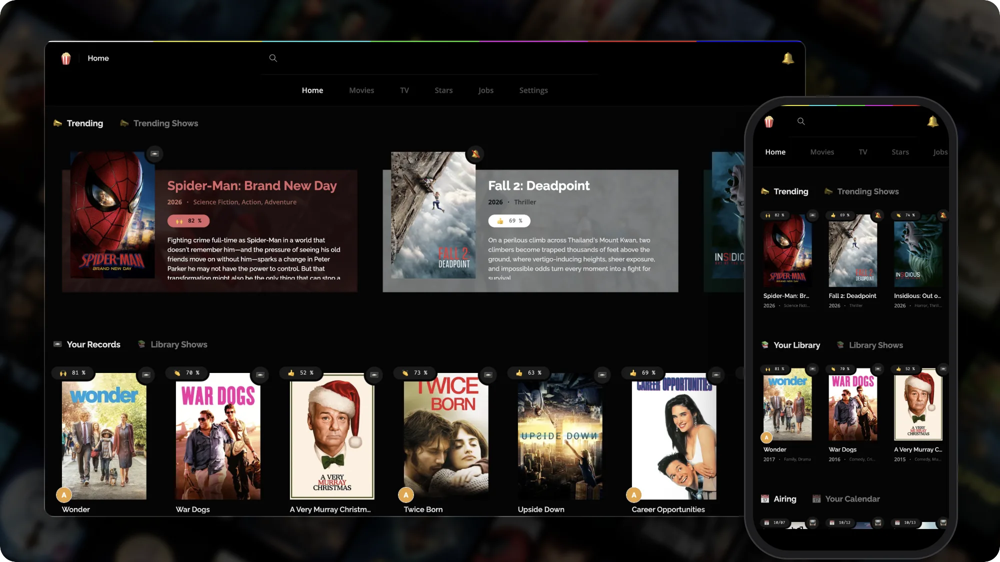
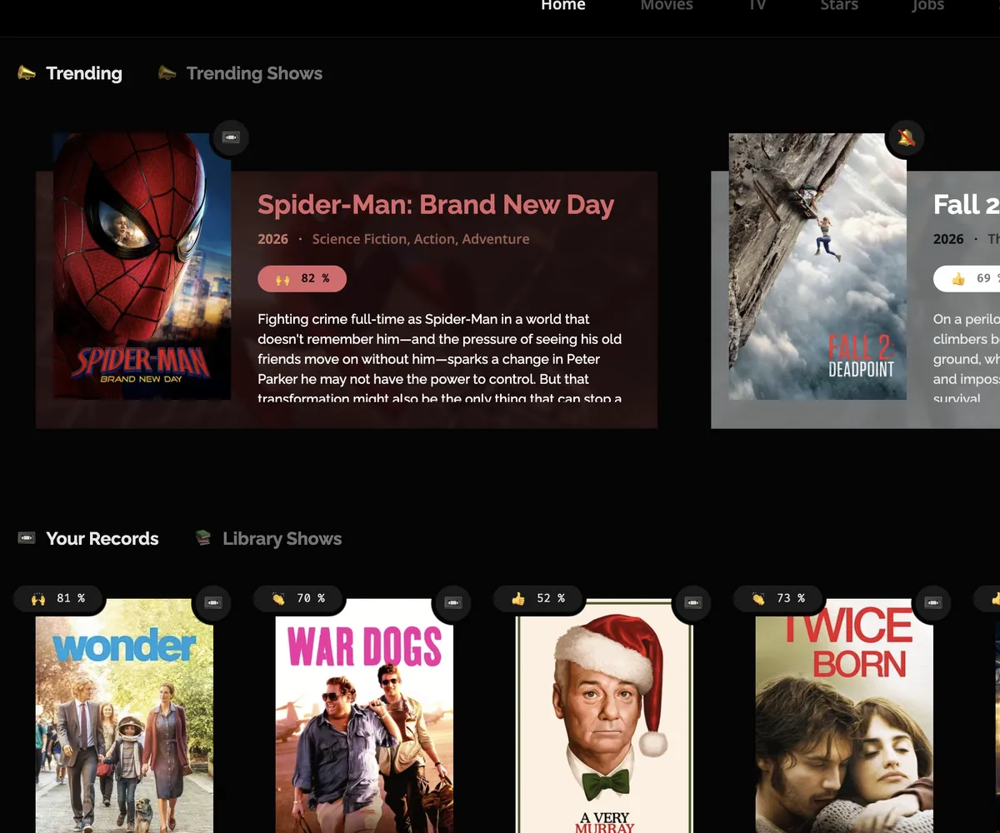
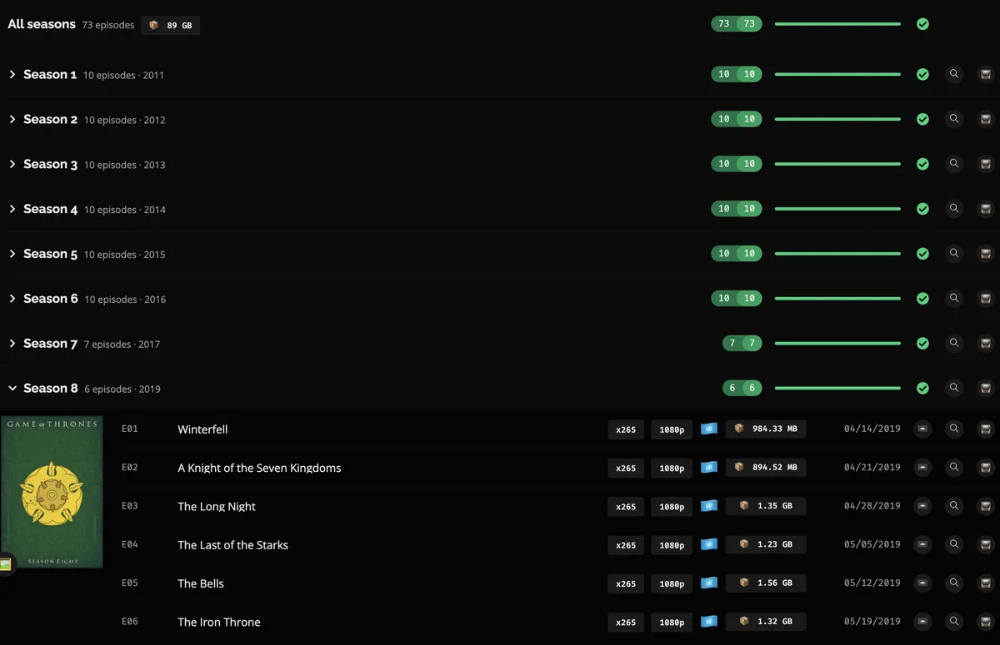
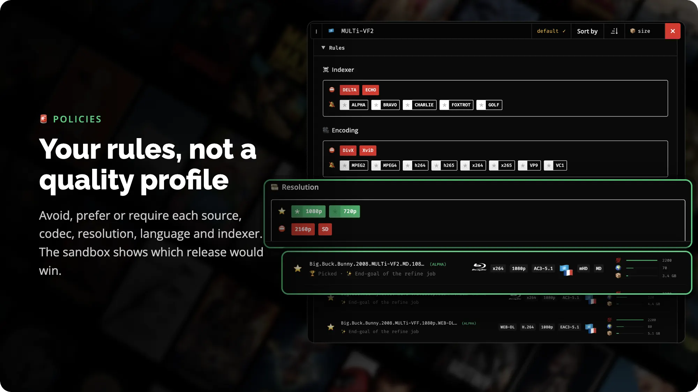
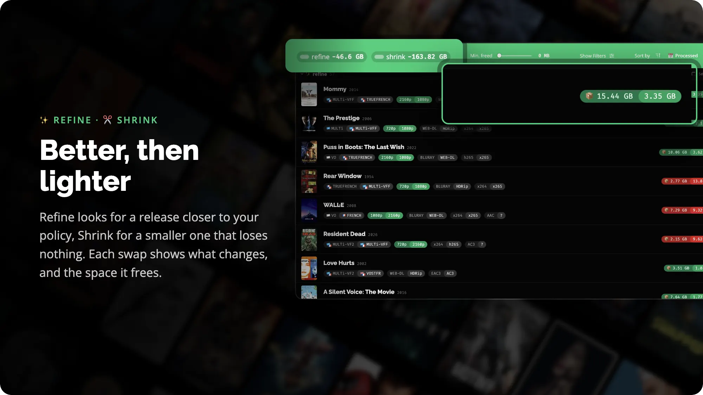
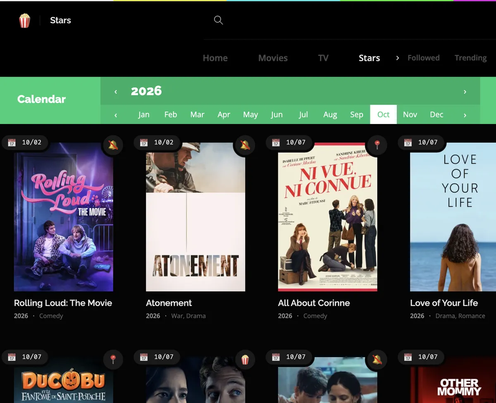
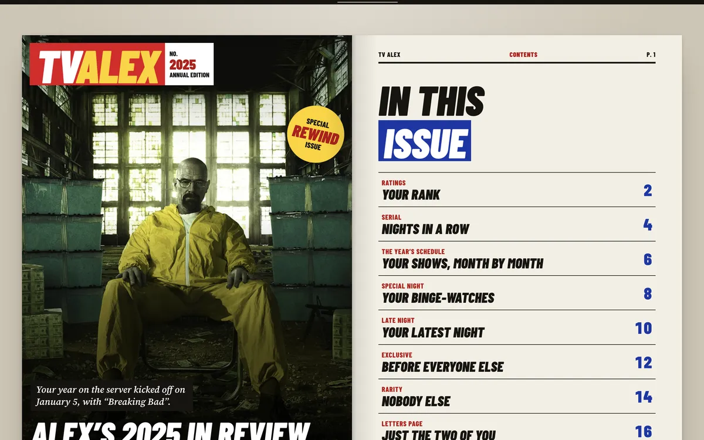
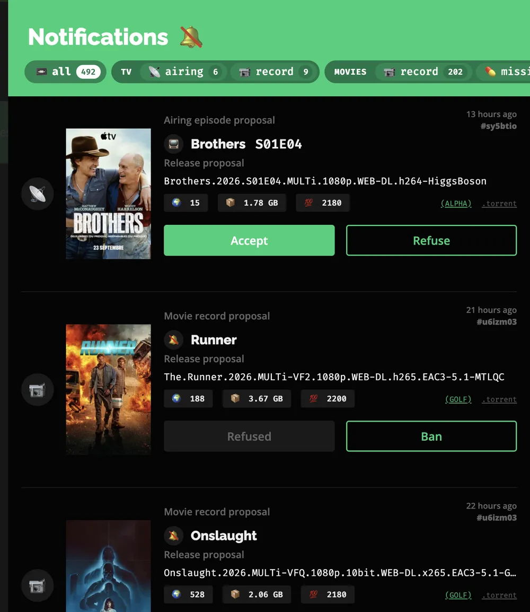
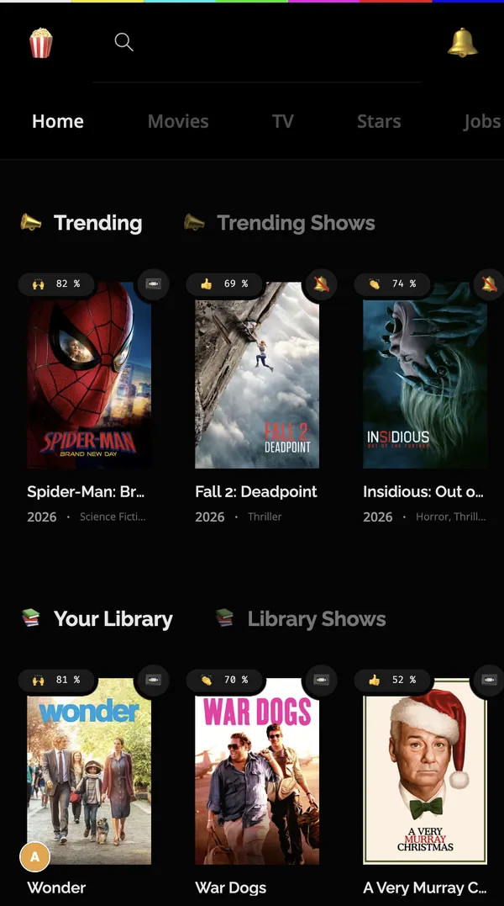

<p align="center">
  
</p>

<h1 align="center">Sensorr</h1>

<p align="center">
  🍿📼 Your Friendly Digital Video Recorder. Think VCR but in modern times.
</p>

<p align="center">
  <a href="https://thcolin.github.io/sensorr/"><b>Try the demo</b></a>
  &nbsp;·&nbsp;
  <a href="#install"><b>Install</b></a>
  &nbsp;·&nbsp;
  <a href="#documentation"><b>Documentation</b></a>
</p>

<p align="center">
  
</p>

You tell Sensorr which movies and TV shows you want. It searches your Torznab indexers on a schedule, ranks every release it finds against your own rules, and drops the winner into the folder your download client watches. Then it keeps going: it looks for a better or a lighter version of what you already own, turns your friends' Plex watchlists into requests, and shows you what's coming from the people you follow.

It is one app where you would otherwise run Radarr, Sonarr and Overseerr side by side, built for one person hosting their own library at home.

**[Try the demo](https://thcolin.github.io/sensorr/)**, login `demo` / `demo`. It runs in your browser, on TMDB's movies and shows with made-up libraries, releases and jobs: accept a proposal, follow a show, search an indexer, and your changes stay in this browser until you reset them. Jobs, Plex, friends and mails need Sensorr running on your own server.

<table>
  <tr>
    <td width="42%">

### Movies and series, one app

One library for both, with the same screens, the same policies and the same jobs. Home, Discover, Trending, Calendar and Requests each have a movie side and a show side, one tab apart.

</td>
    <td width="58%"></td>
  </tr>
  <tr>
    <td width="58%"></td>
    <td width="42%">

### A whole series, a season, an episode

Follow a show, one season or one episode. An ended show you own nothing of is searched as a complete pack first, then season by season, then episode by episode. Finished files are hard linked into your shows library, so your download client keeps seeding and Plex picks them up.

</td>
  </tr>
  <tr>
    <td width="42%">

### Policies, not quality profiles

Seven axes, source, encoding, resolution, language, dub, flags and indexer, each split into `avoid`, `prefer` and `require`. Drag the tags to rank them, and the sandbox ranks a set of sample releases with your policy as you edit it.

</td>
    <td width="58%"></td>
  </tr>
  <tr>
    <td width="58%"></td>
    <td width="42%">

### Swaps: Refine and Shrink

Sensorr keeps working once a movie is in your library. `refine` looks for a release closer to your policy, `shrink` for a lighter one that loses nothing. Each swap shows what changes, language, resolution, source, codec, and the space it frees or costs. Accept it, and with cleanup on, the old file leaves Plex once the new one has landed.

</td>
  </tr>
  <tr>
    <td width="42%">

### Follow people, see what's coming

Follow a director, an actor or a composer, and their next films land in a calendar, month by month. The shows you follow get a calendar of their episodes.

</td>
    <td width="58%"></td>
  </tr>
  <tr>
    <td width="58%"></td>
    <td width="42%">

### Friends: requests and a wrapped

A friend links their Plex account with a code, and the movies and shows on their Plex watchlist become requests you accept or ignore. They get a mail once a week with what reached Plex, and a wrapped of their year on your server, in five looks.

</td>
  </tr>
  <tr>
    <td width="42%">

### Notifications

A web push when a job grabs a release, proposes one, finds a movie missing from Plex or picks up a request. Accept or refuse a proposal from the notification itself.

</td>
    <td width="58%"></td>
  </tr>
  <tr>
    <td width="58%" align="center"></td>
    <td width="42%">

### On your phone

Sensorr is a PWA: add it to your home screen from Safari or Chrome, and it opens like an app, with its push notifications.

</td>
  </tr>
</table>

### And also

- **Plex in sync.** `sync` reads what Plex holds, and a movie a friend reports from Plex is searched again, its replacement proposed to you.
- **Coming from Sonarr or Sensorr 0.x.** `migrate sonarr` takes over your series, what Sonarr follows per season and per episode, and the folder of each show. A 0.x dump is imported from the onboarding.
- **Magnet links.** An indexer that only gives magnet links gets its movie releases written as `.magnet` files, for a download client that reads them.
- **Backup and update from the app.** *Settings › Backup* writes and imports dumps of your library, weekly once turned on. *Settings › Update* shows what each channel offers, and updates the stack with the `updater` profile on.
- **English and French.** The interface, the mails and the wrapped.

# Install

The images are published on GHCR for `linux/amd64` and `linux/arm64`. On arm64, MongoDB 8 needs an ARMv8.2-A CPU: a Raspberry Pi 5 runs it, a Pi 4 does not.

With Docker and Docker Compose installed, run the installer:

```sh
curl --proto =https -fsSL https://raw.githubusercontent.com/thcolin/sensorr/dev/install.sh | sh
```

It asks for the install folder, `~/.sensorr` by default, the channel, the blackhole and shows folders, your username and password, `sensorr` and `sensorr` by default, the time zone, whether to [update from the app](#update-from-the-app), off by default, and your TMDB API key. It generates the auth secret and the database password, starts the stack, and gives the URL once the login works. Run it again in the same folder to repair an install: it keeps every value its `.env` holds, asks only for the missing ones, then pulls and restarts the stack.

The first login opens an onboarding: TMDB, your indexers, a first policy, the blackhole, Plex, your friends and mail, then the jobs. Only TMDB is required, every other step can be skipped and changed later in *Settings*.

## Manual install

```sh
# Choose an install folder for Sensorr install and config files
mkdir ~/.sensorr && cd ~/.sensorr

# Download install files
curl -o docker-compose.yml https://raw.githubusercontent.com/thcolin/sensorr/dev/docker-compose.yml
curl -o config.json https://raw.githubusercontent.com/thcolin/sensorr/dev/config.default.json
curl --create-dirs -o docker/sensorr-db/0-init-mongodb.js https://raw.githubusercontent.com/thcolin/sensorr/dev/docker/sensorr-db/0-init-mongodb.js

# Create every folder the stack mounts: Docker on a Synology refuses to start on a missing one
mkdir -p caddy/data caddy/config caddy/certs db .secrets dumps blackhole tvshows

# Set your own Sensorr secrets, username and password
echo "SENSORR_AUTH_SECRET=youshouldchangethisvaluetoanythingelse" >> .env
echo "SENSORR_USERNAME=username" >> .env
echo "SENSORR_PASSWORD=password" >> .env
echo "SENSORR_DATABASE_PASSWORD=anotherpassword" >> .env

# Define your "blackhole" directory where .torrent files will be downloaded
echo "SENSORR_BLACKHOLE=/home/user/downloads" >> .env

# Define your shows directory, mounted whole as /tvshows: the shows library, its blackhole and the download client's staging folder live under it, see "Series" below
echo "SENSORR_TVSHOWS=/home/user/tvshows" >> .env

# Define your "server contact information" (either a `mailto:` or `https` link) required if you want to enable web push notifications, see ["What is VAPID and why is it useful?"](https://stackoverflow.com/questions/40392257/what-is-vapid-and-why-is-it-useful)
echo "SENSORR_VAPID_SUBJECT=mailto:admin@example.com" >> .env

# Set your own TimeZone, see ["TZ identifier"](https://en.wikipedia.org/wiki/List_of_tz_database_time_zones#List)
echo "TZ=Europe/Paris" >> .env

# Launch the stack
docker compose up -d

# Sensorr is now available at,
# * http://localhost:5070
# * https://localhost:5071
# Use previously defined username/password to login
```

## From 0.x

Sensorr 0.x ran as the `thcolin/sensorr` image, its config mounted on `/app/sensorr/config` and its downloads on `/app/sensorr/blackhole`.

1. In the 0.x, *Settings > Database > Dump* downloads a `.zip` of your movies and stars.
2. Stop the 0.x container, it listens on `5070` too.
3. Run the installer with the 0.x config folder as install folder, and its downloads folder as blackhole. The installer keeps the `config.json` it finds there, and the API converts it on its first boot: the TMDB key, the region, the indexers and the policy stay, the login moves to `.env`, Plex is linked again from the onboarding. The 0.x file is kept as `.secrets/config.json.bak`.
4. On the first login, the onboarding asks where you come from: pick *From a 0.x* and send the `.zip`. It is imported by the `migrate` job once TMDB answers, follow it in *Jobs*. Movies keep their `wished` or `archived` state, stars become `followed`, and `ignored` movies are left behind.

## Series

The shows directory holds three folders, all set from *Settings > Blackhole*: the library at
its root, `.blackhole` where Sensorr writes the `.torrent` of a show release, and `.staging`
where your download client saves it. Point your download client at both: watch
`.blackhole`, save into `.staging` with the torrent's own folder layout. `import shows` then
hard links the files into the library, and your Plex show section reads the library.

The three have to sit on one filesystem and inside one mount of `sensorr-api`: a hard link
cannot cross either. That is why `docker-compose.yml` mounts `SENSORR_TVSHOWS` whole instead
of one volume per folder.

`import shows` knows a file is still downloading from qBittorrent's `.!qB` suffix (*Options >
Downloads > Append .!qB extension to incomplete files*), or from a size below the one the
`.torrent` announces. The five series jobs are paused in the shipped configuration: start them
from *Settings > Schedule*.

## HTTPS

Use custom key/cert for HTTPS (default to [`tls internal { on_demand }`](https://caddyserver.com/docs/automatic-https#on-demand-tls)). The folder holding them is mounted whole as `/certs`, and the two names are the files inside it (default `sensorr.cert` and `sensorr.key`)

```sh
echo "CADDY_TLS_MODE=custom" >> .env
echo "SENSORR_SSL_DIR=/path/to/certs" >> .env
echo "SENSORR_SSL_CERT_NAME=domain.cert" >> .env
echo "SENSORR_SSL_KEY_NAME=domain.key" >> .env
```

On a Synology, point it at the certificate DSM manages, in `/usr/syno/etc/certificate/_archive/<id>`, where `<id>` is what `sudo cat /usr/syno/etc/certificate/_archive/DEFAULT` prints for the default certificate

```sh
echo "SENSORR_SSL_DIR=/usr/syno/etc/certificate/_archive/<id>" >> .env
echo "SENSORR_SSL_CERT_NAME=fullchain.pem" >> .env
echo "SENSORR_SSL_KEY_NAME=privkey.pem" >> .env
```

Caddy reads the files when it starts: after a renewal, restart it with `docker container restart sensorr-web`

`SENSORR_SSL_KEY` and `SENSORR_SSL_CERT` are no longer read: an install that set them moves to `SENSORR_SSL_DIR`, `SENSORR_SSL_CERT_NAME` and `SENSORR_SSL_KEY_NAME`

## Configuration

When you edit manually your `config.json`, you need to restart `sensorr-api` container to apply your changes

```sh
docker container restart sensorr-api
```

# Update

The stack follows the latest release. Pull the new images and recreate the containers:

```sh
cd ~/.sensorr
docker compose pull
docker compose up -d
```

To pin a version, set it in `.env`, for example `SENSORR_TAG=1.0.0`. `SENSORR_TAG=beta` follows the beta releases, once the first one is tagged, `SENSORR_TAG=dev` the `dev` branch, rebuilt on every push. What changed in each release is in the [changelog](CHANGELOG.md).

Until `v1.0.0` is tagged, no `latest` image exists: set `SENSORR_TAG=dev` in `.env` before `docker compose up -d`.

## Update from the app

Settings › Update shows the version that runs and what each channel offers: stable, the `latest` tag, beta, the `beta` tag, or dev, the `dev` tag rebuilt on every push to the `dev` branch. With the `updater` compose profile on, it also updates the stack: `sensorr-updater` writes `SENSORR_TAG` into the env file you pass to compose, `.env` by default, the last one holding a `SENSORR_TAG=` line when you pass several, pulls the images of the channel you picked, and recreates `sensorr-api`, `sensorr-web` and itself. It leaves `sensorr-db` running, and your next `docker compose up -d` recreates `sensorr-db` on the new tag.

```sh
cd ~/.sensorr
echo "COMPOSE_PROFILES=updater" >> .env
docker compose up -d
```

`sensorr-updater` holds the Docker socket, which controls every container of the host. It publishes no port and only talks to `sensorr-api`, over the `updater` network, which has no way out, with the secret `sensorr-api` generates in `.secrets/updater` on its first boot. An update is refused while a [job](docs/jobs.md) runs, since recreating `sensorr-api` would kill it. Without the profile, the page gives the commands to run instead.

# Dump and import

Settings › Backup writes your library and its settings into a `.zip` in `dumps/` of the install folder: movies, TV shows, episodes and stars as JSON lines, `config.json`, and a `manifest.json` with the version of Sensorr and the count of each. The keys and passwords stay out, the TMDB key, every indexer key, the Plex token, the mail password, the Tautulli and MediUX keys, and so does the key an indexer leaves in a release link. The addresses those keys go to, Plex, Tautulli and the mail server, stay out with them. The wrapped, the jobs' logs and your friends' Plex tokens stay out too; the email of the friends who requested a movie or a show stays in, on that movie or show.

The `dump` job does the same every Sunday at 4:00 once turned on in Settings › Schedule, and keeps the last 4. A dump only reaches `dumps/` with the `./dumps:/app/dumps` volume of `docker-compose.yml`: an install made before Settings › Backup needs that line in its compose file, and a `mkdir dumps` in its install folder.

The same page imports a dump, one of its list or a `.zip` from your device, after telling what it holds, and so does the onboarding of a new instance, under *From a dump*. The import replaces the movies, TV shows, episodes and stars, and the settings but their keys and passwords: those of the instance that imports stay with their addresses, an indexer of the same name at the same address keeps its key, and each job stays paused or running as it was. It is refused while a job runs, and it runs as the `restore` job: each collection is filled aside and counted first, so a dump that breaks leaves the library as it was. From a shell, `docker exec sensorr-api bin/sensorr dump` writes one. Import from the page only: started from a shell, a restore would run next to the jobs the API starts.

# Documentation

- [Configuration](docs/configuration.md), every key of `config.json`
- [Jobs, proposals and policy](docs/jobs.md), what each job is for and how a release gets ranked
- [Development](docs/development.md), running Sensorr from a clone
- [Architecture](docs/architecture.md), what talks to what

# License

MIT, see [LICENSE](LICENSE).
