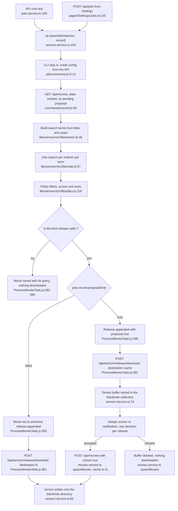

# Architecture

What talks to what, and why. File inventories belong to `ls` and to the
[project graph](#project-graph), not here.

## Context

Sensorr is a self-hosted movie DVR; the [README](../README.md) says what it does for the
person running it. It is built for a single household: one login
(`apps/api/src/app/auth/auth.service.ts:11` compares against two environment variables),
plus Plex accounts registered as guests.

Four systems live outside the boundary.

| System | Reached through | Called by |
| --- | --- | --- |
| TMDB | `@sensorr/tmdb` (`libs/tmdb/src/tmdb.ts:8`, `https://api.themoviedb.org/3/`) | the browser (`apps/web/src/store/tmdb.tsx:4`) and the CLI (`apps/cli/src/commands/sync.js:29`, `refresh.js`, `keep-in-touch.js`, `migrate.js`) |
| znab indexers (Torznab) | `@sensorr/sensorr` (`libs/sensorr/src/lib/znab.ts:57`) | the CLI directly, the browser through the API proxy |
| Plex, `plex.tv` for PIN auth, `community.plex.tv` for the reported issues, and a Plex Media Server for the library | `@sensorr/plex` (`libs/plex/src/lib/pin.ts:3`, `reports.ts`, `plex.ts:4`) | the API (`plex.service.ts`, `guests.service.ts`) and the CLI (`sync`, `keep-in-touch`, `report`) |
| Web push services | `web-push` in `apps/api/src/app/notifications/notifications.service.ts:107` | the API only |

The API never calls TMDB over HTTP. It imports `fields` from `@sensorr/tmdb` for query
building, and that module holds no `fetch`.

The blackhole is not a system, it is the handoff. Sensorr writes a file into a directory
(`apps/api/src/app/sensorr/sensorr.service.ts:65`) and stops there; whatever picks the file
up is never named, never configured, never contacted.

## Containers

Three applications and a database.

**`apps/web`** is a React PWA, served as static files. Talks to the API over HTTP under
`/api`, with a JWT in the `Authorization` header, and keeps Server-Sent Events streams open
for anything live: movie metadata (`movies.controller.ts:54`), jobs and their logs
(`jobs.controller.ts:20,25,45,61`), notifications (`notifications.controller.ts:14`). It
calls TMDB straight from the browser, and reaches the indexers through the API proxy:
`libs/sensorr/src/lib/znab.ts:37` rewrites the indexer URL into `/api/proxy?target=…` when
the `proxify` option is set, which `apps/web/src/store/sensorr.tsx:7` sets and the CLI does
not.

**`apps/api`** is the NestJS server. It owns Mongo, `config.json`, the blackhole
directory and the cron schedule. Every route is behind a global JWT guard (`auth.module.ts:19`,
`auth.guard.ts:10`); only routes marked `@Public()` escape it: guest
registration, guest PIN status (`guests.controller.ts:10,16`) and the login route itself.

**`apps/cli`** is an `ink` terminal app. It carries every long job, one command per job
([jobs.md](jobs.md)). It is not standalone: the first thing any command does is log into
the API and load the configuration from it (`apps/cli/src/utils/command.js:9-13`), and
importing its logger opens a Mongo connection at module load
(`apps/cli/src/store/logger.js:5`).

**`apps/db`** is a `mongo:6.0.6` image with a replacement entrypoint. It is the only
container that is not an Nx project: it has no `project.json`, Docker builds it and
nothing else knows about it.

### How the API runs the CLI

By spawning a process. `apps/api/src/app/sensorr/sensorr.service.ts:103`:

```ts
const child = cp.spawn(SENSORR_BIN, [command])
```

`SENSORR_BIN` is `NX_SENSORR_BIN`, defaulting to `bin/sensorr` (`sensorr.service.ts:18`),
a shell wrapper that execs `dist/apps/cli/main.js` (`bin/sensorr:3`), so it runs the last build, not
the sources.

The handshake between them is one line of stdout. When stdin is not a TTY the CLI prints
`{"job":"<nanoid>"}` before anything else (`apps/cli/src/main.js:39-41`), and the API parses
that first line to learn the job id (`sensorr.service.ts:108-114`). After that the two never
speak over the pipe again: the CLI reports through the `log` collection in Mongo and acts
through the HTTP API, exactly like the browser does. The API keeps the child only to expose
progress (`jobs.controller.ts:25`) and to kill it (`sensorr.service.ts:138`).

The crons live on the same mechanism. `jobs.controller.ts:17` calls `setupCrons()` at boot,
`jobs.service.ts:88-104` creates one `CronJob` per job that is not `paused`, and each tick
calls `runProcess`. So a second running API means a second set of crons writing for real.

## The main flow, end to end

How a wished movie becomes a `.torrent` in the blackhole.



Every step writes to the `log` collection as it goes, and the API turns that collection's
change stream into the SSE the web app is listening to. That is why the Jobs screen follows
a run it never started.

`refine` and `shrink` are the same path with a different entry list and one extra guard:
they compare the candidate against the releases the movie already has, and refuse a release
that does not beat them on score, or on size for `shrink`
(`apps/cli/src/components/Tasks/ProcessMoviesTask.js:306-353`). Both default to
`proposalOnly`, `record` does not, see `docs/configuration.md`.

## Data

One Mongo database, `sensorr`, six collections. Schemas are Mongoose classes under
`apps/api/src/app/`.

| Collection | Schema | What it holds |
| --- | --- | --- |
| `movies` | `movies/movie.schema.ts:5` | a TMDB movie document, plus what Sensorr adds: `state`, `policy`, `query`, `releases[]`, `banned_releases`, `requested_by` |
| `persons` | `persons/person.schema.ts:5` | a TMDB person document, plus `state`; `followed` keeps it, `ignored` deletes it (`upsertPerson` in `persons.service.ts`) |
| `guests` | `guests/guest.schema.ts:5` | a Plex account whose watchlist `keep-in-touch` reads, with its Plex token and that token's health |
| `log` | `logs/log.schema.ts:6` | every line any CLI run emits; a TTL index expires them after two weeks (`log.schema.ts:25`) |
| `subscriptions` | `notifications/subscription.schema.ts:4` | web push endpoints and their keys |
| `blackhole` | `sensorr/metafile.schema.ts:4` | the `.torrent` buffer of a pending proposal, keyed by the release link |

The `_id` of a movie and of a person is its TMDB id, not an ObjectId
(`movie.schema.ts:7-8`, `person.schema.ts:7-8`). There is no separate mapping table.

Mongo has to run as a replica set, and that is not a preference. Four places call
`Model.watch()`, at `jobs.service.ts:36` and `:67`, `notifications.service.ts:31` and
`listenMetadata` in `movies.service.ts`, and change streams do not exist outside a replica
set. A plain `mongod` accepts the connection and then fails on the first SSE endpoint.
`apps/db/docker-entrypoint.sh:11` starts `mongod --replSet rs0 --bind_ip_all --keyFile`,
generating the keyfile on first boot if it is missing (`:3-6`), and the `sensorr-db`
healthcheck of `docker-compose.yml` runs `rs.initiate` until it answers.

## Configuration and secrets

Configuration lives in three places, and they do not overlap.

**Process environment**, the `NX_*` variables. Where the database is, which port to
listen on, the login pair, the JWT secret. Read directly from `process.env`, never written.
Compose passes them in from `.env`.

**`config.json`** holds everything the running app can change about itself: the TMDB key,
the blackhole path, the indexers, the policies, the cron schedules, the Plex binding. Its
schema is the convict declaration in `libs/config/src/index.js`; the API resolves the file
at `apps/api/src/app/config/config.service.ts:14`, serves it over `GET /api/config` and
rewrites it whole on every settings change (`:42-46`). It also writes a freshly generated
Plex client identifier into it on first boot (`:28-35`), so booting the API against a
checkout edits the file. `config.default.json` is the tracked template, `config.json` is
gitignored. The field-by-field reference is [`docs/configuration.md`](configuration.md),
generated from the schema. Do not restate it here.

**`.secrets/`** holds files generated once and kept: the VAPID keypair for web push,
created by `apps/api/docker-entrypoint.sh:3-6` and loaded into the environment at boot
(`apps/api/src/main.ts:13-17`), and the Mongo replica set keyfile. Gitignored.

What is actually secret: `NX_SENSORR_AUTH_SECRET`, which signs the 90-day JWT
(`auth.module.ts:11-12`); the Mongo credentials; the TMDB key and every indexer key, which
sit inside `config.json`; `plex.token` in the same file; each guest's `plex_token` in Mongo;
and the VAPID private key. Everything in that list lives in a gitignored file or in the
database, none of it in the repository.

One boundary is deliberately loose and marked as such: `/api/proxy` forwards any request to
any URL passed as `?target=`. It is behind the JWT guard like every other route, but any
authenticated caller can use the API as an open forwarder. The TODO is in the code
(`apps/api/src/app/proxy/proxy.controller.ts:33`).

## Deployment

One `docker compose up` on a self-hosted server. `docker-compose.yml` defines three
services.

| Service | Image | Built from | Boundary it owns |
| --- | --- | --- | --- |
| `sensorr-web` | `sensorr/sensorr-web` | `apps/web/Dockerfile`, where `node:18-alpine` builds the PWA and `caddy:2.6.4` serves it | the only ports published, `5070` for HTTP and `5071` for HTTPS, from the `ports:` block of its `docker-compose.yml` service; Caddy reverse-proxies `/api/*` to `sensorr-api:4300` and falls back to `index.html` for everything else (`docker/sensorr-web/Caddyfile:11-18`) |
| `sensorr-api` | `sensorr/sensorr-api` | `apps/api/Dockerfile`, which builds **both** the api and the cli bundles and copies `dist/` and `bin/` into the runtime stage | Mongo, `config.json`, `.secrets/`, and the blackhole, all three mounted as volumes |
| `sensorr-db` | `sensorr/sensorr-db` | `apps/db/Dockerfile`, `mongo:6.0.6` with the replica set entrypoint | the data, under `./db` |

Nothing but `sensorr-web` publishes a port. The API is reachable only through Caddy, and
Mongo only from inside the compose network.

The API image builds the CLI because the API spawns it
([How the API runs the CLI](#how-the-api-runs-the-cli)): compose sets
`NX_SENSORR_BIN=/app/bin/sensorr`, and both bundles were produced by
`apps/api/Dockerfile:14-17`. One image, two bundles, one spawn boundary between them.

## Project graph

Fourteen Nx projects, and the dependency edges between them are worth looking at rather
than reading. Generate the graph:

```sh
npx nx graph --file=docs/assets/nx-graph.html
```

Then open `docs/assets/nx-graph.html`. The output is gitignored: it drags a
`docs/assets/static/` directory of 3.7 MB behind it, which has no business in a repository
this size.

`apps/db` is absent from that graph, on purpose: it is not an Nx project, see
[Containers](#containers).
