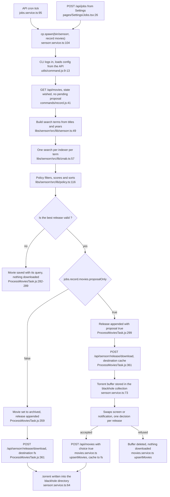
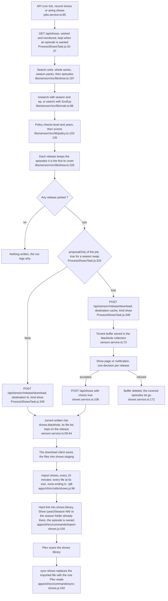

# Architecture

What talks to what, and why. File inventories belong to `ls` and to the
[project graph](#project-graph), not here.

## Context

Sensorr is a self-hosted DVR for movies and TV series; the [README](../README.md) says what it does for the
person running it. It is built for a single household: one login
(`apps/api/src/app/auth/auth.service.ts:11` compares against two environment variables),
plus Plex accounts registered as guests.

Five systems live outside the boundary.

| System | Reached through | Called by |
| --- | --- | --- |
| TMDB | `@sensorr/tmdb` (`libs/tmdb/src/tmdb.ts:8`, `https://api.themoviedb.org/3/`) | the browser (`apps/web/src/store/tmdb.tsx:4`) and the CLI (`apps/cli/src/commands/sync.js:30`, `refresh.js`, `keep-in-touch.js`, `migrate.js`, and for series `refresh-shows.js`, `sync-shows.js`, `migrate-sonarr.js` through `fetchShow`, `libs/tmdb/src/shows.ts:97`) |
| znab indexers (Torznab) | `@sensorr/sensorr` (`libs/sensorr/src/lib/znab.ts:57`) | the CLI directly, the browser through the API proxy |
| Plex, `plex.tv` for PIN auth, `community.plex.tv` for the reported issues, and a Plex Media Server for the library | `@sensorr/plex` (`libs/plex/src/lib/pin.ts:3`, `reports.ts`, `plex.ts:4`) | the API (`plex.service.ts`, `guests.service.ts`) and the CLI (`sync movies`, `sync shows`, `keep-in-touch`, `report movies`) |
| Sonarr, its API v3 | a `GET`-only `fetch` in `apps/cli/src/commands/migrate-sonarr.js:38-48`, keyed by `SONARR_API_KEY` | the CLI only, `migrate sonarr`, a command run once by hand |
| Web push services | `web-push` in `apps/api/src/app/notifications/notifications.service.ts:107` | the API only |

The API never calls TMDB over HTTP. It imports `fields` from `@sensorr/tmdb` for query
building, and that module holds no `fetch`.

The blackhole is not a system, it is the handoff. Sensorr writes a file into a directory
(`apps/api/src/app/sensorr/sensorr.service.ts:64`) and stops there; whatever picks the file
up is never named, never configured, never contacted. Series have a blackhole of their own,
`shows.blackhole` (`sensorr.service.ts:34`), and one step more: `import shows` reads the
folder the download client saves into, `shows.staging`, and hard links the finished files
into the shows library. The client is still never contacted. What Sensorr relies on is
qBittorrent's `.!qB` suffix on an incomplete file and the sizes the `.torrent` announces
([A series release, end to end](#a-series-release-end-to-end)).

## Containers

Five applications and a database.

**`apps/web`** is a React PWA, served as static files. Talks to the API over HTTP under
`/api`, with a JWT in the `Authorization` header, and keeps Server-Sent Events streams open
for anything live: movie metadata (`movies.controller.ts:54`), show metadata (`shows.controller.ts:37`), jobs and their logs
(`jobs.controller.ts:21,25,45,61`), notifications (`notifications.controller.ts:14`). It
calls TMDB straight from the browser, and reaches the indexers through the API proxy:
`libs/sensorr/src/lib/znab.ts:37` rewrites the indexer URL into `/api/proxy?target=…` when
the `proxify` option is set, which `apps/web/src/store/sensorr.tsx:7` sets and the CLI does
not.

**`apps/wrapped`** is the yearly wrapped a guest opens from a link, a React page served as
static files under `/wrapped/<token>`. It has no login: the token is the access, and it reads
`GET /api/wrapped/share/:token` plus the artwork route beside it. It draws the same sheets,
worded once in `apps/wrapped/src/app/sheets.ts`, in one of five looks under
`apps/wrapped/src/app/themes/`, none of which follows `DESIGN.md`. Settings › Friends lists the
years Tautulli has plays for (`GET /api/wrapped/years`), each one open or not and with its look
(`wrapped.editions` in `config.json`, a year left out is open); a year turned off is neither shown,
frozen nor mailed. `lookOf` in `libs/sensorr/src/lib/wrapped.ts` gives the look of the year, or,
when the year sets none, the first look offered (`wrapped.looks`) with `look.choice` on: the friend
then switches the look on the page and the browser keeps it.

On a screen under 1024 px wide, a look listed in `STORIES` (`apps/wrapped/src/app/themes/index.ts`)
shows the sheets as stories, one 396 × 704 page each, and each story is shared as a 1080 × 1920
JPEG. The API draws it: `GET /api/wrapped/share/:token/cards/:look/:story`, public like the share,
answers only for a look this friend may wear, then opens `/wrapped/<token>?card=<story>&look=<look>`
in a headless Chromium (`apps/api/src/app/wrapped/cards.service.ts`), one card at a time, three at
most per friend, and captures the page once it sets `data-card="ready"`. The page lives at
`NX_WRAPPED_URL`, `http://sensorr-web` by default, through Caddy's `http://` block. The Chromium is
the `sensorr-chromium` container, reached at `NX_CHROMIUM_URL`; without that variable the API
launches the Chromium at `NX_CHROMIUM_PATH` itself, which is how development runs. Cards are kept
for two days, 512 MB at most, in `$TMPDIR/sensorr-cards`, inside the API container's writable layer:
on the server's own disk, and gone when the container is recreated.

**`apps/api`** is the NestJS server. It owns Mongo, `config.json`, the two blackhole
directories and the cron schedule. Every route is behind a global JWT guard (`auth.module.ts:19`,
`auth.guard.ts:10`); only routes marked `@Public()` escape it: guest
registration, guest PIN status (`guests.controller.ts:10,16`), which links a new account only when it owns the Plex server set up in Sensorr or is shared with it, unless `guests.public` is on, a guest's wrapped and its artwork
(`wrapped.controller.ts:11,18`), the unsubscribe page of a mail and its button
(`mail.controller.ts`, `unsubscribe/:token`), and the login route
itself.

**`apps/cli`** is an `ink` terminal app. It carries every long job, one command per job
([jobs.md](jobs.md)). It is not standalone: the first thing any command does is log into
the API and load the configuration from it (`apps/cli/src/utils/command.js:9-13`), and
importing its logger opens a Mongo connection at module load
(`apps/cli/src/store/logger.js:5`).

**`apps/updater`** is one Node file without dependencies, `apps/updater/src/main.mjs`, run by
`sensorr-updater`. It holds the Docker socket and moves the stack to another image tag on
`sensorr-api`'s request, see [The updater](#the-updater).

**`apps/db`** is a `mongo:8.0` image with a replacement entrypoint. It is the only
container that is not an Nx project: it has no `project.json`, Docker builds it and
nothing else knows about it.

### How the API runs the CLI

By spawning a process. `apps/api/src/app/sensorr/sensorr.service.ts:104`:

```ts
const child = cp.spawn(SENSORR_BIN, [command, type].filter(Boolean))
```

`type` is `movies` or `shows`, left out for `keep-in-touch`: `record shows` runs
`bin/sensorr record shows` ([jobs.md](jobs.md#how-a-job-runs)).

`SENSORR_BIN` is `NX_SENSORR_BIN`, defaulting to `bin/sensorr` (`sensorr.service.ts:18`),
a shell wrapper that execs `dist/apps/cli/main.js` (`bin/sensorr:3`), so it runs the last build, not
the sources.

The handshake between them is one line of stdout. When stdin is not a TTY the CLI prints
`{"job":"<nanoid>"}` before anything else (`apps/cli/src/main.js:40-42`), and the API parses
that first line to learn the job id (`runProcess` in `sensorr.service.ts`). A spawn that fails, a missing
bundle among them, or a child that exits before that line, rejects the request instead of leaving it
open. One run per command at a time: a second one is refused with a 409 while the first one runs
(`lockOf`, `apps/api/src/app/sensorr/lock.ts`). After that the two never
speak over the pipe again: the CLI reports through the `log` collection in Mongo and acts
through the HTTP API, exactly like the browser does. The API keeps the child only to expose
progress (`jobs.controller.ts:26`) and to kill it (`sensorr.service.ts:139`).

The crons live on the same mechanism. `jobs.controller.ts:18` calls `setupCrons()` at boot,
`jobs.service.ts:78-100` creates one `CronJob` per command and type of `JOBS` that is not `paused`, and each tick
calls `runProcess`. So a second running API means a second set of crons writing for real.

## The main flow, end to end

How a wished movie becomes a `.torrent` in the blackhole.


```mermaid
flowchart TD
  cron["API cron tick<br/>jobs.service.ts:95"] --> spawn
  post["POST /api/jobs from Settings<br/>pages/Settings/Jobs.tsx:26"] --> spawn
  spawn["cp.spawn(bin/sensorr, record movies)<br/>sensorr.service.ts:104"] --> boot

  boot["CLI logs in, loads config from the API<br/>utils/command.js:9-13"] --> fetch
  fetch["GET /api/movies, state wished, no pending proposal<br/>commands/record.js:41"] --> query
  query["Build search terms from titles and years<br/>libs/sensorr/src/lib/sensorr.ts:49"] --> search
  search["One search per indexer per term<br/>libs/sensorr/src/lib/znab.ts:57"] --> policy
  policy["Policy filters, scores and sorts<br/>libs/sensorr/src/lib/policy.ts:116"] --> valid

  valid{"Is the best release valid ?"}
  valid -->|no| stop["Movie saved with its query, nothing downloaded<br/>ProcessMoviesTask.js:282-289"]
  valid -->|yes| branch

  branch{"jobs.record.movies.proposalOnly"}
  branch -->|false| direct["Movie set to archived, release appended<br/>ProcessMoviesTask.js:359"]
  branch -->|true| propose["Release appended with proposal true<br/>ProcessMoviesTask.js:299"]

  direct --> dlfs["POST /api/sensorr/release/download, destination fs<br/>ProcessMoviesTask.js:361"]
  propose --> dlcache["POST /api/sensorr/release/download, destination cache<br/>ProcessMoviesTask.js:361"]

  dlfs --> blackhole[".torrent written into the blackhole directory<br/>sensorr.service.ts:64"]
  dlcache --> cached["Torrent buffer stored in the blackhole collection<br/>sensorr.service.ts:73"]

  cached --> review["Swaps screen or notification, one decision per release"]
  review -->|accepted| accept["POST /api/movies with choice true<br/>movies.service.ts upsertMovies, cache to fs"]
  review -->|refused| refuse["Buffer deleted, nothing downloaded<br/>movies.service.ts upsertMovies"]
  accept --> blackhole
```

Every step writes to the `log` collection as it goes, and the API turns that collection's
change stream into the SSE the web app is listening to. That is why the Jobs screen follows
a run it never started.

`refine` and `shrink` are the same path with a different entry list and one extra guard:
they compare the candidate against the releases the movie already has, and refuse a release
that does not beat them on score, or on size for `shrink`
(`apps/cli/src/components/Tasks/ProcessMoviesTask.js:306-353`). Both default to
`proposalOnly`, `record` does not, see `docs/configuration.md`.

## A series release, end to end

How a wanted episode becomes a file in the shows library. The search is `record shows`,
daily, or `airing shows`, hourly, the same component with a narrower entry list
(`apps/cli/src/components/Tasks/ProcessShowsTask.js:21`, `:58`).


```mermaid
flowchart TD
  cron["API cron tick, record shows or airing shows<br/>jobs.service.ts:95"] --> fetch
  fetch["GET /api/shows, wished and monitored, kept when an episode is wanted<br/>ProcessShowsTask.js:32-37"] --> units
  units["Search units: whole series, season packs, then episodes<br/>libs/sensorr/src/lib/show.ts:197"] --> search
  search["tvsearch with season and ep, or search with SxxEyy<br/>libs/sensorr/src/lib/znab.ts:88"] --> policy
  policy["Policy checks level and years, then scores<br/>libs/sensorr/src/lib/policy.ts:133-135"] --> pick
  pick["Each release keeps the episodes it is the first to cover<br/>libs/sensorr/src/lib/show.ts:226"] --> picked

  picked{"Any release picked ?"}
  picked -->|no| stop["Nothing written, the run logs why"]
  picked -->|yes| branch

  branch{"proposalOnly of the job, true for a season swap<br/>ProcessShowsTask.js:325"}
  branch -->|false| dlfs["POST /api/sensorr/release/download, destination fs, kind show<br/>ProcessShowsTask.js:349"]
  branch -->|true| dlcache["POST /api/sensorr/release/download, destination cache, kind show<br/>ProcessShowsTask.js:349"]

  dlfs --> blackhole[".torrent written into shows.blackhole, its file list kept on the release<br/>sensorr.service.ts:59-64"]
  dlcache --> cached["Torrent buffer stored in the blackhole collection<br/>sensorr.service.ts:73"]

  cached --> review["Show page or notification, one decision per release"]
  review -->|accepted| accept["POST /api/shows with choice true<br/>shows.service.ts:106"]
  review -->|refused| refuse["Buffer deleted, the covered episodes let go<br/>shows.service.ts:172"]
  accept --> blackhole

  blackhole --> client["The download client saves the files into shows.staging"]
  client --> import["import shows, every 10 minutes: every file at its size, none ending in .!qB<br/>apps/cli/src/utils/shows.js:96"]
  import --> link["Hard link into shows.library, Show (year)/Season NN/ or the season folder already there, the episode is owned<br/>apps/cli/src/commands/import-shows.js:150"]
  link --> plex["Plex scans the shows library"]
  plex --> sync["sync shows replaces the imported file with the one Plex reads<br/>apps/cli/src/commands/sync-shows.js:192"]
```

Both a direct download and a proposal write the release id onto every episode it covers,
before the download and only on the episodes whose `release` is still empty, then push the
release onto the show (`ProcessShowsTask.js`), so the episodes read
`proposed` from then on and no later run searches them again (`episodeStatus`,
`libs/sensorr/src/lib/episode.ts:4`). Refusing clears that id and the episodes are `wanted`
again, and so do two jobs: `import shows` for an accepted release still not imported a week
later (`import-shows.js:189-204`), `sync shows` for an episode whose file left Plex
(`sync-shows.js:201`). An episode is `owned` as soon as the import links its file: the import
writes that file on the episode, marked `from: 'import'`, and stamps the release `imported_at`;
`sync shows` later replaces the entry with the file Plex reads (`import-shows.js`). Why each job selects what it does is in
[jobs.md](jobs.md#series).

The show page also searches by hand, from the ticket under the poster for the whole series or
from the search badge of a season or an episode row (`apps/web/src/pages/Shows/Show.tsx`). The
browser runs the same `tvsearch` from that level up to the whole series (`reachParamsOf`,
`libs/sensorr/src/lib/show.ts`), and keeps only the releases that hold the target. A pick skips
the proposal: it is posted with `job: 'manual'` and `choice: true`, downloaded into
`shows.blackhole` at once, and covers every episode its release holds, followed or not, as a swap
when some of them are owned (`manualPickOf`). A pending proposal on one of those episodes is
refused once the pick is accepted (`shows.service.ts:136-146`). A show out of the library is added first,
unfollowed, so the import has episodes to link.

### One volume for the hard link

`import shows` calls `fs.link` (`apps/cli/src/commands/import-shows.js:150`), and Linux
refuses a hard link across two mount points with `EXDEV`, even when both mount the same
filesystem. Inside a container every bind mount is a mount point of its own, so the staging
folder and the library have to come through one volume. `docker-compose.yml:51` mounts
`SENSORR_TVSHOWS` whole on `/tvshows`, and the three `shows` keys default to folders under
it (`libs/config/src/index.js:39-55`). On the host, the download client has to write into
that same filesystem.

A link that fails is logged and never replaced by a copy, which would take the space the link
saves (`import-shows.js:145`). Every error but `EEXIST` leaves the release for the next run
(`import-shows.js:153`, `:173`), so a split mount shows as the same warning every ten
minutes rather than as a silent miss.

## Data

One Mongo database, `sensorr`, eight collections. Schemas are Mongoose classes under
`apps/api/src/app/`.

| Collection | Schema | What it holds |
| --- | --- | --- |
| `movies` | `movies/movie.schema.ts:5` | a TMDB movie document, plus what Sensorr adds: `state`, `policy`, `query`, `releases[]`, `banned_releases`, `requested_by` |
| `shows` | `shows/show.schema.ts:5` | a TMDB TV show document, with the summary of its `seasons[]` and its `external_ids`, plus what Sensorr adds: `state`, `monitored`, `monitor_new_seasons`, `policy`, `query`, `path`, `plex_guid`, `requested_by`, `banned_releases`, `releases[]`. A release is stored once on the show, with the episodes it covers (`coverage`) and, once its `.torrent` has been read, its files (`torrent`) |
| `episodes` | `shows/episode.schema.ts:5` | a TMDB episode, tied to its show by `show_id`, plus `monitored`, the `files` `sync shows` saw on Plex, and `release`, the id of the release that covers it. Its status is computed from those, never stored (`episodeStatus` in `libs/sensorr/src/lib/episode.ts:4`) |
| `persons` | `persons/person.schema.ts:5` | a TMDB person document, plus `state`; `followed` keeps it, `ignored` deletes it (`upsertPerson` in `persons.service.ts`) |
| `guests` | `guests/guest.schema.ts:5` | a Plex account whose watchlist `keep-in-touch` reads, with its Plex token and that token's health |
| `log` | `logs/log.schema.ts:6` | every line any CLI run emits; a TTL index expires them after two weeks (`log.schema.ts:25`) |
| `subscriptions` | `notifications/subscription.schema.ts:4` | web push endpoints and their keys |
| `blackhole` | `sensorr/metafile.schema.ts:4` | the `.torrent` buffer of a pending proposal, keyed by the release link |

The `_id` of a movie, a person, a show and an episode is its TMDB id, not an ObjectId
(`movie.schema.ts:7-8`, `person.schema.ts:7-8`, `show.schema.ts:7-8`,
`episode.schema.ts:7-8`). There is no separate mapping table. The two TMDB id spaces do not
collide because movies and shows live in two collections.

Mongo has to run as a replica set, and that is not a preference. Three places call
`Model.watch()`: `logs.service.ts:14`, which the jobs and notifications streams are built on
(`jobs.service.ts:46`, `:69`, `notifications.service.ts:44`), `movies.service.ts:26` and
`shows.service.ts:32`, and change streams do not exist outside a replica set. A plain `mongod` accepts the connection and then fails on the first SSE endpoint.
`apps/db/docker-entrypoint.sh:11` starts `mongod --replSet rs0 --bind_ip_all --keyFile`,
generating the keyfile on first boot if it is missing (`:3-6`), and the `sensorr-db`
healthcheck of `docker-compose.yml` runs `rs.initiate` until it answers.

## Configuration and secrets

Configuration lives in three places, and they do not overlap.

**Process environment**, the `NX_*` variables. Where the database is, which port to
listen on, the login pair, the JWT secret. Read directly from `process.env`, never written.
Compose passes them in from `.env`.

**`config.json`** holds everything the running app can change about itself: the TMDB key,
the blackhole path, the indexers, the policies, the cron schedules, the Plex binding. Its
schema is the convict declaration in `libs/config/src/index.js`; the API resolves the file
at `apps/api/src/app/config/config.service.ts:16`, serves it over `GET /api/config` and
rewrites it whole on every settings change (`:59-63`). It also writes a freshly generated
Plex client identifier into it on first boot (`:31-38`), so booting the API against a
checkout edits the file. Before loading it, a file that still holds the job keys of before
`jobs.<command>.<type>` is copied to `.secrets/config.json.bak`, readable by its owner only,
and rewritten with every key moved, values kept (`migrate` in
`apps/api/src/app/config/config.service.ts`, `migrateJobs` in `apps/api/src/app/config/migrate.ts`).
A migrated file is left alone. Compose mounts `config.json` as a single file but `.secrets/`
as a folder (`docker-compose.yml`), so the copy lands on the host, in `./.secrets/`, and
outlives the container. `config.default.json` is the tracked template, `config.json` is
gitignored. The field-by-field reference is [`docs/configuration.md`](configuration.md),
generated from the schema. Do not restate it here.

**`.secrets/`** holds files generated once and kept: the VAPID keypair for web push,
created by `apps/api/docker-entrypoint.sh:3-6` and loaded into the environment at boot
(`apps/api/src/main.ts:13-17`), the Mongo replica set keyfile, and the copy of `config.json` taken before its jobs were migrated. Gitignored.

What is actually secret: `NX_SENSORR_AUTH_SECRET`, which signs the 90-day JWT
(`auth.module.ts:11-12`); the Mongo credentials; the TMDB key and every indexer key, which
sit inside `config.json`; `plex.token` and `mail.password` in the same file; each guest's `plex_token` in Mongo;
and the VAPID private key. Everything in that list lives in a gitignored file or in the
database, none of it in the repository.

One boundary is deliberately loose and marked as such: `/api/proxy` forwards any request to
any URL passed as `?target=`. It is behind the JWT guard like every other route, but any
authenticated caller can use the API as an open forwarder. The TODO is in the code
(`apps/api/src/app/proxy/proxy.controller.ts:33`).

## Deployment

One `docker compose up` on a self-hosted server. `docker-compose.yml` defines five
services, `sensorr-updater` only under the `updater` profile.

| Service | Image | Built from | Boundary it owns |
| --- | --- | --- | --- |
| `sensorr-web` | `ghcr.io/thcolin/sensorr-web` | `apps/web/Dockerfile`, where `node:26-alpine` builds the PWA and the wrapped page, and `caddy:2.11.4` serves them | the only ports published, `5070` for HTTP and `5071` for HTTPS, from the `ports:` block of its `docker-compose.yml` service; Caddy reverse-proxies `/api/*` to `sensorr-api:4300`, serves `/wrapped/*` from the wrapped build with its own `index.html`, and falls back to the PWA's `index.html` for everything else (`docker/sensorr-web/Caddyfile:11-25`) |
| `sensorr-api` | `ghcr.io/thcolin/sensorr-api` | `apps/api/Dockerfile`, which builds **both** the api and the cli bundles and copies `dist/` and `bin/` into the runtime stage | Mongo, `config.json`, `.secrets/`, the blackhole and the shows directory, the last four mounted as volumes |
| `sensorr-chromium` | `chromedp/headless-shell`, pinned | pulled, not built | Debian's Chromium, whose software WebGL paints the Affiche's posters (Alpine's has none); the API drives it over the DevTools protocol on port `9222`. No secret, no volume, a 1 GB memory limit, and only the `cards` network, `internal`, shared with `sensorr-web` and `sensorr-api`: it reaches the wrapped page and nothing outside |
| `sensorr-updater` | `ghcr.io/thcolin/sensorr-updater` | `apps/updater/Dockerfile`, `node:26-alpine` with the Docker CLI and its compose plugin | the Docker socket, mounted from the host; no port, and only the `updater` network, `internal`, shared with `sensorr-api`. See [The updater](#the-updater) |
| `sensorr-db` | `ghcr.io/thcolin/sensorr-db` | `apps/db/Dockerfile`, `mongo:8.0` with the replica set entrypoint | the data, under `./db` |

The shows directory is one volume and not three, for the hard link, see
[One volume for the hard link](#one-volume-for-the-hard-link).

Nothing but `sensorr-web` publishes a port. The API is reachable only through Caddy, and
Mongo only from inside the compose network.

The API image builds the CLI because the API spawns it
([How the API runs the CLI](#how-the-api-runs-the-cli)): compose sets
`NX_SENSORR_BIN=/app/bin/sensorr`, and both bundles were produced by
`apps/api/Dockerfile:14-17`. One image, two bundles, one spawn boundary between them.

### Images

`.github/workflows/ci.yml` builds the four Sensorr images once a push to `dev`, a
`vX.Y.Z-beta.N` tag or a `vX.Y.Z` tag has passed lint, test and the production build. A tag
first goes through `tools/release/check-tag.mjs`, which refuses it unless it matches the
`package.json` version and tags `dev` for a beta, `main` for a stable release. The steps of a
release are in [`RELEASING.md`](../RELEASING.md). Each image is built for
`linux/amd64` and `linux/arm64`, each platform on a native GitHub runner, by
`docker/github-builder`, and pushed to GHCR with the workflow's own `GITHUB_TOKEN`.

| Event | Tags |
| --- | --- |
| push to `dev` | `dev`, `sha-<short sha>` |
| tag `vX.Y.Z-beta.N` | `X.Y.Z-beta.N`, `beta` |
| tag `vX.Y.Z` | `X.Y.Z`, `X.Y`, `latest` |

Every image carries the OCI labels `org.opencontainers.image.version`, the first tag above,
and `org.opencontainers.image.revision`, the full commit SHA.

`docker-compose.yml` pulls `${SENSORR_TAG:-latest}`. A server that follows `dev` sets
`SENSORR_TAG=dev` in the env file it passes to compose, and updates with:

```sh
docker compose --env-file <env file> pull sensorr-api sensorr-web
docker compose --env-file <env file> up -d sensorr-api sensorr-web
```

Recreating `sensorr-api` kills a running job, see
[How the API runs the CLI](#how-the-api-runs-the-cli). The `build:` blocks stay in
`docker-compose.yml` for a build from a clone, `docker compose build`.

### The updater

Settings › Update reads `GET /api/update` (`apps/api/src/app/update/update.service.ts`): the
running version, from the root `package.json`; its commit, `NX_SENSORR_REVISION`, which `ci.yml`
passes to `apps/api/Dockerfile` as a build argument; the tag, `NX_SENSORR_TAG`, which compose sets
to `SENSORR_TAG`, and the channel it means (`channelOf` in `apps/api/src/app/update/update.ts`:
`dev` for `dev` and the `sha-<short sha>` tags of [Images](#images), `beta` for `beta` and
`X.Y.Z-beta.N`, stable for the rest); what each channel offers, the version and revision labels of
`sensorr-api:beta`, `sensorr-api:latest` and `sensorr-api:dev`, read on GHCR by the API with an anonymous token,
since GHCR sends no CORS headers to a browser, and kept 15 minutes, until the next update; and what `sensorr-updater` answers, `null`
when its host name does not resolve, that is without the `updater` profile.

The `dev` image always carries the version `dev`: a newer push shows as a `channels.dev.revision`
other than `revision`. Only `sensorr-api` is read: right after a push its image can be newer than
the `sensorr-web` one, still building.
`POST /api/update {channel}`, `beta`, `stable` or `dev`, is refused with a 409 while a job runs
([jobs.md](jobs.md)), with a 404 without the `updater` profile, and is otherwise forwarded to
`sensorr-updater` as `POST /update {tag}`: `beta` and `dev` keep their name, `stable` becomes
`latest`. A cron of `sensorr-api` that ticks during the pull still starts its job, and the
recreation of `sensorr-api` kills it.
Both sides read the secret in `.secrets/updater`, which `apps/api/docker-entrypoint.sh` generates
on first boot; `sensorr-updater` mounts `.secrets/` read-only.

`sensorr-updater` does not recreate the services itself, since it is one of them. It starts
`sensorr-updater-run`, a one-off container outside `docker-compose.yml`, of its own image, with the
Docker socket, no network, and the project's folders mounted at their host paths: the working
directory, the env files and the compose files. `sensorr-updater` reads their paths in its own
labels, `com.docker.compose.project.*`, which compose sets on every container it creates.
`sensorr-updater-run` runs the `apply` command of `apps/updater/src/main.mjs`: it rewrites every
`SENSORR_TAG=` line of the last env file that has one, or appends the line to the last env file
(`withTag`), keeping its owner and mode, then runs `docker compose pull` and `up -d` on
`sensorr-api`, `sensorr-web` and `sensorr-updater`, under the same project name and the `updater`
profile. The next update removes `sensorr-updater-run`, so its logs and exit code stay until then: `GET /status`
reports them, and the page stops waiting on a non-zero exit. The page reloads once `/api/update`
answers with the version it waited for, or on `dev` with the `dev` tag and the revision it waited
for, and gives up after five minutes.

The boundary is the Docker socket: whoever reaches `sensorr-updater` with the secret controls every
container of the host. So it publishes no port, sits on the `updater` network, `internal`, that only
`sensorr-api` joins, takes one update at a time, and only takes `beta` or `latest`. It leaves
`sensorr-db` running, but the image of `sensorr-db` follows `SENSORR_TAG` too: the next `docker
compose up -d` recreates it on the new tag, and a new tag can carry a new Mongo major, which goes
through its feature compatibility version by hand, see [Upgrading Mongo](#upgrading-mongo).

### Upgrading Mongo

`mongod` 8.0 only opens data files written by 7.0, once their feature compatibility
version (FCV) reads `7.0`, and 7.0 only opens those of 6.0 with an FCV of `6.0`. Data written by
`mongo:6.0.6` therefore reaches 8.0 through two upgrades, 6.0 to 7.0 then 7.0 to 8.0, and
`apps/db/Dockerfile` takes the Mongo version as the `MONGO_VERSION` build argument for the
7.0 image. Replayed locally on a throwaway `./db` on 2026-10-02, rollback included: the
data stayed, and `mongod` reported 7.0.43 then 8.0.32.

Set `ENV_FILE` to the env file the deployment runs compose with. `mongosh` and `mongodump`
read their credentials from the `sensorr-db` container's environment, and a container
recreated with the default `.env` gets the wrong ones.

```sh
C() { docker compose --env-file "$ENV_FILE" "$@"; }
M='mongosh --quiet -u "$MONGO_INITDB_ROOT_USERNAME" -p "$MONGO_INITDB_ROOT_PASSWORD" --authenticationDatabase admin'

# 1. Stop the API, and with it every cron. Check the FCV reads 6.0, then back up.
C stop sensorr-api
C exec -T sensorr-db sh -c "$M --eval 'db.adminCommand({ getParameter: 1, featureCompatibilityVersion: 1 }).featureCompatibilityVersion.version'"
C exec -T sensorr-db sh -c 'mongodump -u "$MONGO_INITDB_ROOT_USERNAME" -p "$MONGO_INITDB_ROOT_PASSWORD" --authenticationDatabase admin --db sensorr --gzip --archive' > sensorr.archive.gz && ls -lh sensorr.archive.gz

# 2. The 7.0 image, then FCV 7.0
C stop -t 60 sensorr-db
C build --build-arg MONGO_VERSION=7.0 sensorr-db
C up -d --wait sensorr-db
C exec -T sensorr-db sh -c "$M --eval 'db.adminCommand({ setFeatureCompatibilityVersion: \"7.0\", confirm: true })'"

# 3. The 8.0 image, the Dockerfile default, then FCV 8.0
C stop -t 60 sensorr-db
C build sensorr-db
C up -d --wait sensorr-db
C exec -T sensorr-db sh -c "$M --eval 'db.adminCommand({ setFeatureCompatibilityVersion: \"8.0\", confirm: true })'"

C up -d sensorr-api
```

`ls -lh` only prints when `mongodump` exited 0; without that line, a failed dump still
leaves an empty `sensorr.archive.gz`. `stop -t 60` matters: within the default 10
seconds `mongod` may not close its files, and the next version then refuses to start on
them. `--wait` returns once the `sensorr-db` healthcheck passes, and it runs every 30
seconds.

Going back means starting over from the archive, the only copy of the data once `./db`
is emptied. `mongo:6.0.6` is the image this repo ran before 8.0, and an empty `./db`
makes it create the root user again:

```sh
C stop -t 60 sensorr-db
sudo find ./db -mindepth 1 -delete
C build --build-arg MONGO_VERSION=6.0.6 sensorr-db
C up -d --wait sensorr-db
C exec -T sensorr-db sh -c 'mongorestore -u "$MONGO_INITDB_ROOT_USERNAME" -p "$MONGO_INITDB_ROOT_PASSWORD" --authenticationDatabase admin --gzip --archive' < sensorr.archive.gz
C up -d sensorr-api
```

## Project graph

Fifteen Nx projects, and the dependency edges between them are worth looking at rather
than reading. Generate the graph:

```sh
npx nx graph --file=docs/assets/nx-graph.html
```

Then open `docs/assets/nx-graph.html`. The output is gitignored: it drags a
`docs/assets/static/` directory of 3.7 MB behind it, which has no business in a repository
this size.

`apps/db` is absent from that graph, on purpose: it is not an Nx project, see
[Containers](#containers).
